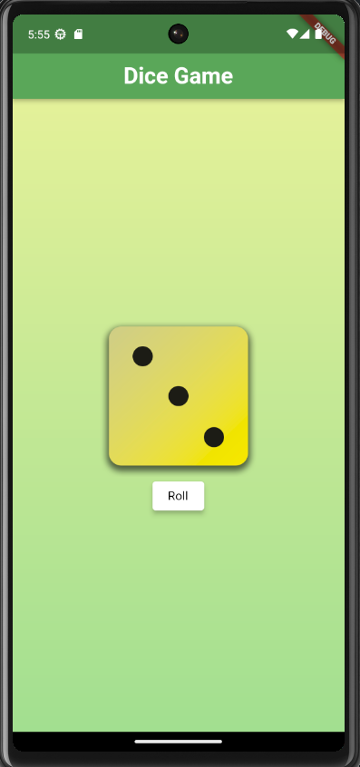

# Flutter Apps

This Repository Contains Basic Flutter Apps. Please go to each project's directory to read the specific readme file. All the instructions and visualization are there to run those projects.

[1. Dice Game](https://github.com/NafBZ/Flutter_projects/tree/master/dice_roll)

  
  &nbsp;&nbsp;&nbsp;&nbsp;&nbsp;&nbsp;&nbsp;&nbsp;&nbsp;
  

[2. Quiz Me](https://github.com/NafBZ/Flutter_projects/tree/master/try_app)

This repo is under development.

  Happy Coding!

