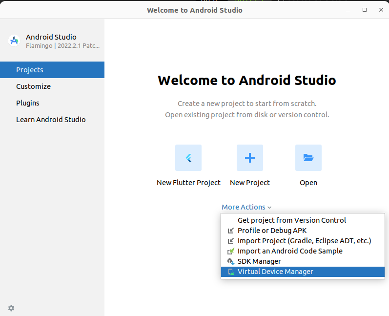
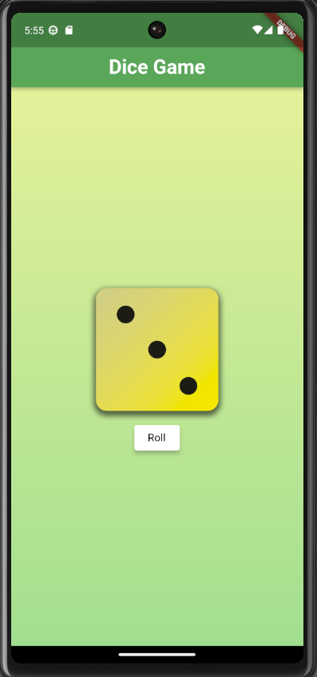
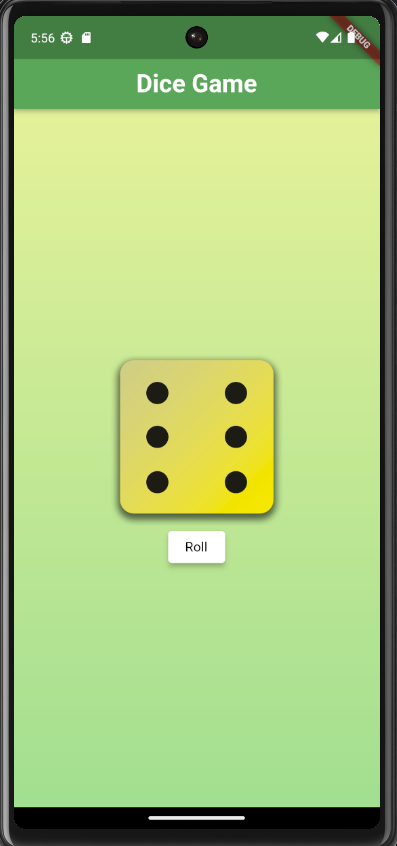

# Roll a Dice

It is a beginner friendly project to understand fundamentals of Dart and Flutter. Stateful and Stateless Custom Widgets are implemented and used in this project. 

## Getting Started

The UI of this mobile app is very simple where you click a button and a random number generates from 1 to 6 and which is shown using a dice face.

> If Flutter and Android studio are installed in your machine, then you can simply execute the follwing codes in your terminal to run the mobile application.


1. First you have to open your android studio and select a virtual device manager that you want. In this case, I have used Pixel 6 as a virtual device.

<p align="center">
  
</p>

If you don't have flutter and android studio installed in your machine plaese click to the follwing link and install those.
- [Installation Guide: Flutter and Android Studio](https://docs.flutter.dev/get-started/install/linux)


For help getting started with Flutter development, view the
[online documentation](https://docs.flutter.dev/), which offers tutorials,
samples, guidance on mobile development, and a full API reference.


2. Now, you should clone the repository and go inside the directory using the following commands.

```
$ git clone https://github.com/NafBZ/Flutter_projects.git

$ cd Flutter_projects/dice_roll/
```
3. Finally, to run the mobile application in the virtual device, simply type the following command in the terminal.

```
flutter run
```
Now you are good to go and will see your virtual device with a option to click a button to roll the dice.

<p align="center">
  
  &nbsp;&nbsp;&nbsp;&nbsp;&nbsp;&nbsp;&nbsp;&nbsp;&nbsp;
  
</p>

&nbsp;&nbsp;&nbsp;&nbsp;&nbsp;&nbsp;&nbsp;&nbsp;&nbsp;

<p align="center">
  <span style="font-size: 36px; font-weight: bold;">Happy Coding!</span>
</p>